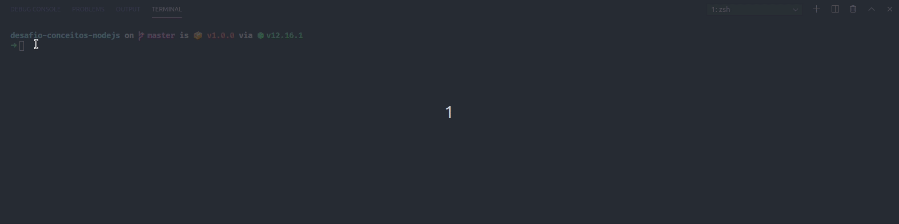

# Desafio conceitos nodejs
Desafio foi elaborado pelo time da RocketSeat para o bootcamp GoStack.

<h2>Objetivo</h2>

Desenvolver o back-end de um portfólio onde será possivel, postar projetos com com título, url 
do repositório, as técnologias utilizadas e para cada visita à URL o projeto irá contabilizar 1 Like 

Para simular o database foi utilizado um <strong>Array vazio (const repositories = [])</strong>

<h2>Testes</h2>

Para testar a funcionalidade da aplicação, foram feitos testes automatizados utilizando jest

<h2>Git clone</h2>

 Para quem estiver interessado em replicar o desafio, basta realizar um git clone https://github.com/Gasorey/desafio-conceitos-nodejs no seu editor de texto em seguida dentro da pasta criada usar o comando "yarn" no terminal criar a pasta node modules

